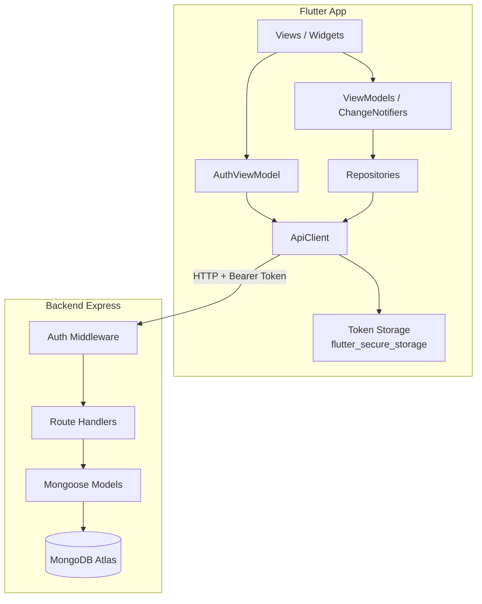
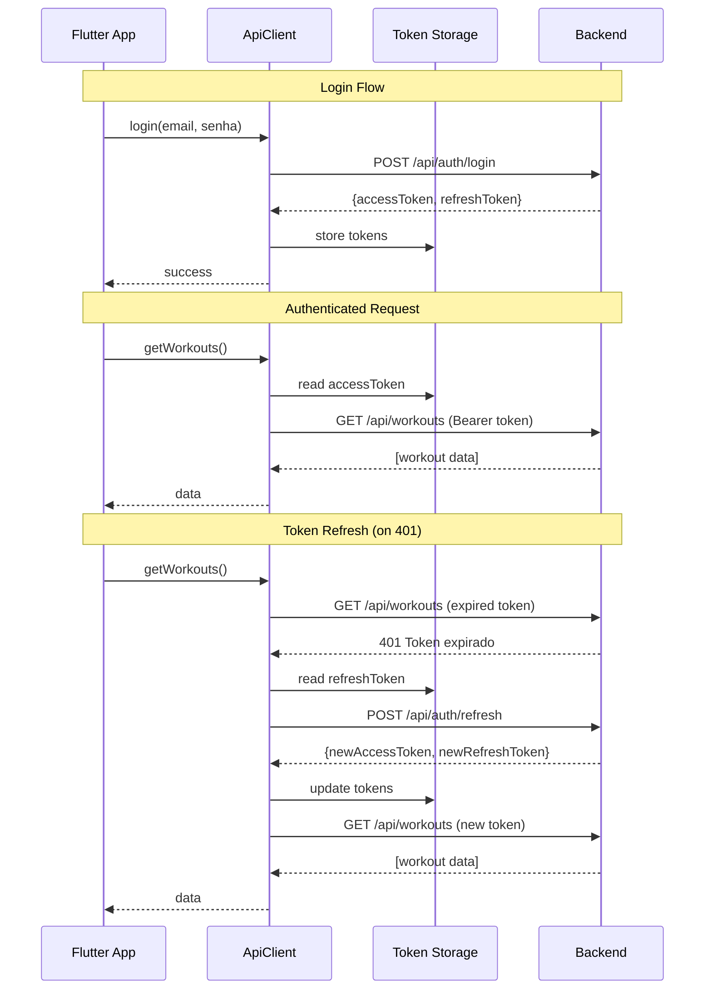
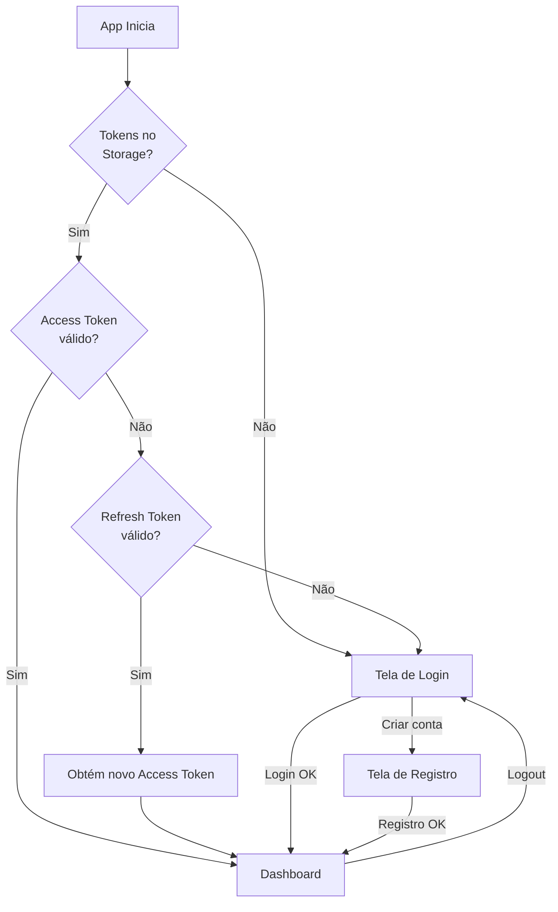

# Design — Integração API & Autenticação

## Overview

Este design cobre duas mudanças estruturais no app Apex.OS:

1. **Remoção de mock data**: Todas as views passam a consumir dados exclusivamente da API REST (backend Node.js/Express/Mongoose em Railway). O módulo `mock_data.dart` é eliminado e substituído por chamadas reais via repositórios. Views sem dados exibem Empty States.

2. **Autenticação JWT**: Sistema completo de registro, login, refresh de token, middleware de proteção de rotas no backend, e gerenciamento de estado de autenticação no Flutter com redirecionamento automático.

### Decisões de Design

- **bcrypt** para hash de senhas (custo 10) — padrão da indústria, resistente a ataques de força bruta.
- **JWT com par access/refresh** — access token curto (15min) limita janela de comprometimento; refresh token longo (7d) evita re-login frequente.
- **flutter_secure_storage** para persistência de tokens — usa Keychain (iOS) e EncryptedSharedPreferences (Android).
- **Interceptor de 401 no ApiClient** — refresh transparente sem intervenção do usuário.
- **userId em todos os modelos** — isolamento de dados por usuário via filtro automático no middleware.
- **Novos modelos WorkoutPlan e DietPlan** — fichas de treino e dieta armazenadas no banco, eliminando dados hardcoded.

## Architecture

### Diagrama de Arquitetura



### Fluxo de Autenticação



### Fluxo de Navegação com Auth Guard



## Components and Interfaces

### Backend — Novos Componentes

#### 1. User Model (`backend/src/models/User.js`)

Modelo Mongoose para usuários com email único e senha hasheada.

```javascript
// Interface
{
  name: String,       // required
  email: String,      // required, unique, lowercase, trimmed
  password: String,   // required, bcrypt hash (min 8 chars raw)
  timestamps: true    // createdAt, updatedAt
}
```

#### 2. WorkoutPlan Model (`backend/src/models/WorkoutPlan.js`)

Ficha de treino com dias e exercícios, vinculada ao userId.

```javascript
// Interface
{
  userId: ObjectId,   // ref: 'User', required
  name: String,       // e.g. "Ficha ABC"
  days: [{
    id: String,
    name: String,     // "Treino A"
    focus: String,    // "Peito + Tríceps"
    day: String,      // "Segunda"
    exercises: [{
      id: String,
      order: Number,
      name: String,
      targetSets: Number,
      targetReps: String,
      targetWeight: Number
    }]
  }],
  timestamps: true
}
```

#### 3. DietPlan Model (`backend/src/models/DietPlan.js`)

Plano alimentar com refeições, vinculado ao userId.

```javascript
// Interface
{
  userId: ObjectId,   // ref: 'User', required
  name: String,       // e.g. "Plano Cutting"
  meals: [{
    id: String,
    name: String,     // "Café da manhã"
    time: String,     // "07:30"
    description: String,
    kcal: Number
  }],
  timestamps: true
}
```

#### 4. Auth Middleware (`backend/src/middleware/auth.js`)

Middleware Express que valida JWT e injeta `req.userId`.

```javascript
// Interface
function authMiddleware(req, res, next)
// - Extrai token do header Authorization: Bearer <token>
// - Verifica com jwt.verify(token, JWT_SECRET)
// - Seta req.userId = decoded.userId
// - Retorna 401 se ausente, expirado ou inválido
```

#### 5. Auth Routes (`backend/src/routes/auth.js`)

```javascript
// POST /api/auth/register — { name, email, password } → { accessToken, refreshToken }
// POST /api/auth/login    — { email, password } → { accessToken, refreshToken }
// POST /api/auth/refresh  — { refreshToken } → { accessToken, refreshToken }
```

#### 6. WorkoutPlan Routes (`backend/src/routes/workoutPlans.js`)

```javascript
// GET    /api/workout-plans      — lista fichas do userId
// POST   /api/workout-plans      — cria ficha para userId
// PUT    /api/workout-plans/:id  — atualiza ficha do userId
```

#### 7. DietPlan Routes (`backend/src/routes/dietPlans.js`)

```javascript
// GET    /api/diet-plans      — lista planos do userId
// POST   /api/diet-plans      — cria plano para userId
// PUT    /api/diet-plans/:id  — atualiza plano do userId
```

#### 8. Seed Script (`backend/src/seed.js`)

Script que popula o banco com os dados atuais de `mock_data.dart` para o primeiro usuário cadastrado.

### Backend — Modificações em Componentes Existentes

#### Modelos existentes — adicionar `userId`

Todos os modelos existentes (WorkoutLog, DietLog, Weight, Activity) recebem o campo:

```javascript
userId: { type: mongoose.Schema.Types.ObjectId, ref: 'User', required: true }
```

#### Rotas existentes — aplicar auth + filtro por userId

Todas as rotas sob `/api/workouts`, `/api/diet`, `/api/activities`, `/api/weight`, `/api/progress` passam a:
1. Usar `authMiddleware` 
2. Filtrar queries por `req.userId`
3. Setar `req.userId` automaticamente em criações

#### `backend/src/index.js` — registrar novas rotas

```javascript
// Novas rotas (auth é pública)
app.use('/api/auth', authRoutes);
// Rotas protegidas
app.use('/api/workouts', authMiddleware, workoutRoutes);
app.use('/api/diet', authMiddleware, dietRoutes);
app.use('/api/workout-plans', authMiddleware, workoutPlanRoutes);
app.use('/api/diet-plans', authMiddleware, dietPlanRoutes);
// ... demais rotas protegidas
```

### Flutter — Novos Componentes

#### 1. AuthViewModel (`lib/features/auth/view_model/auth_view_model.dart`)

ChangeNotifier global que gerencia estado de autenticação.

```dart
class AuthViewModel extends ChangeNotifier {
  bool get isAuthenticated;
  bool get isLoading;
  String? get error;

  Future<void> login(String email, String password);
  Future<void> register(String name, String email, String password);
  Future<void> logout();
  Future<void> tryRestoreSession();  // chamado no app init
}
```

#### 2. TokenService (`lib/data/services/token_service.dart`)

Wrapper sobre `flutter_secure_storage` para persistência de tokens.

```dart
class TokenService {
  Future<void> saveTokens(String accessToken, String refreshToken);
  Future<String?> getAccessToken();
  Future<String?> getRefreshToken();
  Future<void> clearTokens();
  Future<bool> hasTokens();
}
```

#### 3. AuthRepository (`lib/data/repositories/auth_repository.dart`)

Repositório para chamadas de autenticação.

```dart
class AuthRepository {
  Future<AuthResponse> login(String email, String password);
  Future<AuthResponse> register(String name, String email, String password);
  Future<AuthResponse> refresh(String refreshToken);
}
```

#### 4. Login View (`lib/features/auth/view/login_view.dart`)

Tela de login com campos email/senha, botão "Entrar", link "Criar conta".

#### 5. Register View (`lib/features/auth/view/register_view.dart`)

Tela de registro com campos nome/email/senha, botão "Criar conta".

#### 6. WorkoutPlan Repository (`lib/data/repositories/api_workout_plan_repository.dart`)

```dart
class ApiWorkoutPlanRepository {
  Future<List<dynamic>> getWorkoutPlans();
  Future<Map<String, dynamic>> createWorkoutPlan(Map<String, dynamic> data);
  Future<Map<String, dynamic>> updateWorkoutPlan(String id, Map<String, dynamic> data);
}
```

#### 7. DietPlan Repository (`lib/data/repositories/api_diet_plan_repository.dart`)

```dart
class ApiDietPlanRepository {
  Future<List<dynamic>> getDietPlans();
  Future<Map<String, dynamic>> createDietPlan(Map<String, dynamic> data);
  Future<Map<String, dynamic>> updateDietPlan(String id, Map<String, dynamic> data);
}
```

### Flutter — Modificações em Componentes Existentes

#### ApiClient (`lib/data/services/api_client.dart`)

Mudanças:
- Deixa de ser estático puro; recebe `TokenService` como dependência
- Adiciona header `Authorization: Bearer <token>` em todas as requisições
- Intercepta respostas 401 "Token expirado" → tenta refresh automático → repete requisição
- Se refresh falha → limpa tokens e sinaliza logout via callback

```dart
class ApiClient {
  final TokenService _tokenService;
  VoidCallback? onSessionExpired;  // chamado quando refresh falha

  Future<dynamic> get(String path, {Map<String, String>? queryParams});
  Future<dynamic> post(String path, Map<String, dynamic> body);
  Future<dynamic> put(String path, Map<String, dynamic> body);
  Future<void> delete(String path);
}
```

#### GoRouter (`lib/app/router.dart`)

Mudanças:
- Adiciona rotas `/login` e `/register`
- Adiciona `redirect` guard que verifica `AuthViewModel.isAuthenticated`
- `refreshListenable` aponta para `AuthViewModel` para reagir a mudanças de auth state

#### RotinaViewModel

Mudanças:
- Remove imports de `mock_data.dart`
- Carrega `WorkoutPlan` e `DietPlan` via repositórios da API
- Carrega `lastWeekResults` via `ApiWorkoutRepository.getLatestWorkouts()`
- Expõe estado de loading e empty state

#### Demais ViewModels (Dashboard, Progresso, Relatório, Fichas, Configurações)

- Removem referências a `mock_data.dart`
- Carregam dados via repositórios da API
- Expõem estados de loading e empty

### Novas Dependências

**Backend (package.json):**
- `bcryptjs` — hash de senhas
- `jsonwebtoken` — geração e verificação de JWT

**Flutter (pubspec.yaml):**
- `flutter_secure_storage` — armazenamento seguro de tokens

## Data Models

### Backend — Modelo User (novo)

| Campo     | Tipo     | Restrições                          |
|-----------|----------|-------------------------------------|
| name      | String   | required                            |
| email     | String   | required, unique, lowercase, trim   |
| password  | String   | required (bcrypt hash)              |
| createdAt | Date     | auto (timestamps)                   |
| updatedAt | Date     | auto (timestamps)                   |

### Backend — Modelo WorkoutPlan (novo)

| Campo     | Tipo       | Restrições              |
|-----------|------------|-------------------------|
| userId    | ObjectId   | required, ref: 'User'   |
| name      | String     | required                |
| days      | [Object]   | array de WorkoutDay     |
| createdAt | Date       | auto                    |
| updatedAt | Date       | auto                    |

**WorkoutDay (subdocumento):**

| Campo     | Tipo       | Restrições |
|-----------|------------|------------|
| id        | String     | required   |
| name      | String     | required   |
| focus     | String     | required   |
| day       | String     | required   |
| exercises | [Object]   | array      |

**Exercise (subdocumento):**

| Campo        | Tipo   | Restrições |
|--------------|--------|------------|
| id           | String | required   |
| order        | Number | required   |
| name         | String | required   |
| targetSets   | Number | required   |
| targetReps   | String | required   |
| targetWeight | Number | required   |

### Backend — Modelo DietPlan (novo)

| Campo     | Tipo       | Restrições              |
|-----------|------------|-------------------------|
| userId    | ObjectId   | required, ref: 'User'   |
| name      | String     | required                |
| meals     | [Object]   | array de DietMeal       |
| createdAt | Date       | auto                    |
| updatedAt | Date       | auto                    |

**DietMeal (subdocumento):**

| Campo       | Tipo   | Restrições |
|-------------|--------|------------|
| id          | String | required   |
| name        | String | required   |
| time        | String | required   |
| description | String | required   |
| kcal        | Number | required   |

### Backend — Modelos Existentes (modificação)

Todos os modelos existentes recebem o campo `userId`:

| Modelo      | Campo Adicionado | Tipo     | Restrições            |
|-------------|------------------|----------|-----------------------|
| WorkoutLog  | userId           | ObjectId | required, ref: 'User' |
| DietLog     | userId           | ObjectId | required, ref: 'User' |
| Weight      | userId           | ObjectId | required, ref: 'User' |
| Activity    | userId           | ObjectId | required, ref: 'User' |

### Flutter — Modelo AuthResponse (novo)

```dart
class AuthResponse {
  final String accessToken;
  final String refreshToken;
  final String userId;
  final String name;
  final String email;
}
```

### JWT Token Payload

```json
{
  "userId": "ObjectId string",
  "email": "user@example.com",
  "iat": 1700000000,
  "exp": 1700000900
}
```

- Access Token: expira em 15 minutos
- Refresh Token: expira em 7 dias, payload idêntico


## Correctness Properties

*A property is a characteristic or behavior that should hold true across all valid executions of a system — essentially, a formal statement about what the system should do. Properties serve as the bridge between human-readable specifications and machine-verifiable correctness guarantees.*

### Property 1: Registration produces hashed password and valid tokens

*For any* valid registration payload (non-empty name, valid email, password ≥ 8 chars), the created user's stored password SHALL be a bcrypt hash (not plaintext), and the response SHALL contain a valid JWT access token (expiring in 15 minutes) and a valid JWT refresh token (expiring in 7 days).

**Validates: Requirements 3.1, 3.2**

### Property 2: Registration input validation rejects invalid inputs

*For any* registration payload where the email is not a valid email format OR the password has fewer than 8 characters, the API SHALL return status 400 and the user SHALL NOT be created in the database.

**Validates: Requirements 3.4, 3.5**

### Property 3: Login returns tokens with correct expiration

*For any* registered user, logging in with the correct email and password SHALL return an access token expiring in 15 minutes and a refresh token expiring in 7 days, both containing the correct userId in their payload.

**Validates: Requirements 4.2**

### Property 4: Login error messages prevent user enumeration

*For any* failed login attempt — whether the email does not exist or the password is incorrect — the API SHALL return status 401 with the identical message "Credenciais inválidas", making it impossible to distinguish between the two failure modes.

**Validates: Requirements 4.3, 4.4, 4.5**

### Property 5: Token refresh produces new valid tokens

*For any* valid refresh token, the refresh endpoint SHALL return a new access token and a new refresh token, both valid JWTs with correct expiration times and the same userId as the original token.

**Validates: Requirements 5.2**

### Property 6: Invalid tokens are rejected

*For any* string that is not a valid JWT or is a JWT signed with a different secret, the refresh endpoint SHALL return status 401 and SHALL NOT issue new tokens.

**Validates: Requirements 5.4**

### Property 7: Auth middleware validates token and extracts userId

*For any* HTTP request to a protected route, if the Authorization header contains a valid Bearer token, the middleware SHALL extract the userId and attach it to the request. If the header is missing, malformed, or contains an expired/invalid token, the middleware SHALL return status 401 and block the request.

**Validates: Requirements 6.1, 6.4**

### Property 8: Data isolation — queries return only authenticated user's data

*For any* two distinct users A and B, and *for any* protected data route (workouts, diet, activities, weight, workout-plans, diet-plans, progress), when user A queries the route, the response SHALL contain only records where userId equals user A's id, and SHALL NOT contain any records belonging to user B.

**Validates: Requirements 2.1, 2.4, 6.7, 10.3**

### Property 9: Auto-association — created records get userId from token

*For any* valid data payload submitted to a protected creation endpoint (POST), the created record SHALL have its userId field set to the userId extracted from the authentication token, regardless of whether the payload includes a userId field.

**Validates: Requirements 2.2, 2.5, 10.2**

### Property 10: Update preserves ownership

*For any* existing record owned by user A, when user A submits a valid update (PUT), the updated record SHALL retain userId equal to user A's id and SHALL reflect the updated fields.

**Validates: Requirements 2.3, 2.6**

### Property 11: Cross-user access denied

*For any* two distinct users A and B, when user B attempts to update or delete a record owned by user A, the API SHALL return status 403 and the record SHALL remain unchanged.

**Validates: Requirements 10.4**

### Property 12: Token storage round-trip

*For any* pair of (accessToken, refreshToken) strings, storing them via TokenService and then retrieving them SHALL return the exact same strings.

**Validates: Requirements 8.1, 8.6**

### Property 13: Authorization header included in authenticated requests

*For any* HTTP request made by ApiClient while an access token is stored, the request SHALL include the header `Authorization: Bearer <accessToken>` with the exact stored token value.

**Validates: Requirements 8.2**

### Property 14: Route protection redirects unauthenticated users

*For any* protected route path in the GoRouter configuration, when the AuthViewModel reports `isAuthenticated == false`, navigating to that route SHALL redirect to the login route.

**Validates: Requirements 9.4, 9.6**

## Error Handling

### Backend Error Handling

| Cenário | Status | Mensagem | Ação |
|---------|--------|----------|------|
| Email já cadastrado (registro) | 409 | "Email já cadastrado" | Retorna erro, não cria usuário |
| Email inválido (registro) | 400 | "Email inválido" | Retorna erro |
| Senha < 8 chars (registro) | 400 | "A senha deve ter no mínimo 8 caracteres" | Retorna erro |
| Nome vazio (registro) | 400 | "Nome é obrigatório" | Retorna erro |
| Credenciais inválidas (login) | 401 | "Credenciais inválidas" | Mesma msg para email/senha errados |
| Token não fornecido | 401 | "Token não fornecido" | Bloqueia requisição |
| Token expirado | 401 | "Token expirado" | Bloqueia requisição |
| Token inválido | 401 | "Token inválido" | Bloqueia requisição |
| Refresh token expirado | 401 | "Sessão expirada, faça login novamente" | Bloqueia refresh |
| Refresh token inválido | 401 | "Token inválido" | Bloqueia refresh |
| Acesso a recurso de outro usuário | 403 | "Acesso negado" | Bloqueia operação |
| Erro interno do servidor | 500 | "Erro interno do servidor" | Log do erro, resposta genérica |
| Payload inválido (validação Mongoose) | 400 | Mensagem do validador | Retorna detalhes da validação |

### Flutter Error Handling

| Cenário | Comportamento |
|---------|---------------|
| API retorna 401 "Token expirado" | ApiClient tenta refresh automático |
| Refresh falha | Limpa tokens, redireciona para login |
| API retorna 4xx (não-401) | Exibe mensagem de erro da API na UI |
| API retorna 5xx | Exibe mensagem genérica "Erro no servidor, tente novamente" |
| Sem conexão de rede | Exibe mensagem "Sem conexão com a internet" |
| Timeout de requisição | Exibe mensagem "Requisição expirou, tente novamente" |
| Token Storage inacessível | Trata como não-autenticado, redireciona para login |

### Estratégia de Retry

- Refresh automático: máximo 1 tentativa por requisição (evita loops infinitos)
- Se o refresh retorna 401, não tenta novamente — vai direto para logout
- Requisições originais são repetidas no máximo 1 vez após refresh bem-sucedido

## Testing Strategy

### Abordagem Dual: Unit Tests + Property-Based Tests

Este projeto usa uma abordagem dual de testes:

- **Unit tests (example-based)**: Verificam cenários específicos, edge cases e condições de erro
- **Property-based tests**: Verificam propriedades universais que devem valer para todas as entradas válidas

### Property-Based Testing

**Biblioteca**: `glados` (já presente no projeto como dev_dependency) para Dart/Flutter, `fast-check` para Node.js/backend.

**Configuração**:
- Mínimo 100 iterações por property test
- Cada test deve referenciar a propriedade do design document
- Tag format: **Feature: api-auth-integration, Property {number}: {property_text}**

**Properties a implementar (backend — fast-check)**:
- Property 1: Registration produces hashed password and valid tokens
- Property 2: Registration input validation rejects invalid inputs
- Property 3: Login returns tokens with correct expiration
- Property 4: Login error messages prevent user enumeration
- Property 5: Token refresh produces new valid tokens
- Property 6: Invalid tokens are rejected
- Property 7: Auth middleware validates token and extracts userId
- Property 8: Data isolation — queries return only authenticated user's data
- Property 9: Auto-association — created records get userId from token
- Property 10: Update preserves ownership
- Property 11: Cross-user access denied

**Properties a implementar (Flutter — glados)**:
- Property 12: Token storage round-trip
- Property 13: Authorization header included in authenticated requests
- Property 14: Route protection redirects unauthenticated users

### Unit Tests (Example-Based)

**Backend unit tests**:
- Registro com email duplicado retorna 409
- Registro com nome vazio retorna 400
- Login com email inexistente retorna 401
- Login com senha incorreta retorna 401
- Refresh com token expirado retorna 401
- Requisição sem Authorization header retorna 401
- Requisição com token expirado retorna 401
- GET /api/workout-plans sem fichas retorna [] (200)
- GET /api/diet-plans sem fichas retorna [] (200)
- Seed script popula dados corretamente

**Flutter unit tests**:
- Login bem-sucedido armazena tokens e navega para Dashboard
- Login falho exibe mensagem de erro
- Registro bem-sucedido armazena tokens e navega para Dashboard
- Registro falho exibe mensagem de erro
- ApiClient tenta refresh automático em 401
- Refresh falho limpa tokens e redireciona para login
- App inicia sem tokens → redireciona para login
- App inicia com tokens válidos → navega para Dashboard
- Logout limpa tokens e atualiza Auth_State
- Empty states exibidos quando API retorna dados vazios (Dashboard, Progresso, Relatório, Fichas, Rotina)

**Flutter widget tests**:
- Tela de login contém campos email/senha e botão "Entrar"
- Tela de registro contém campos nome/email/senha e botão "Criar conta"
- Link "Criar conta" navega para tela de registro
- Indicador de carregamento exibido durante submit
- Botão desabilitado durante submit

### Integration Tests

- Fluxo completo: registro → login → criar workout plan → consultar → verificar dados
- Fluxo de refresh: login → esperar token expirar → fazer requisição → verificar refresh automático
- Fluxo de isolamento: criar dados com user A → consultar com user B → verificar que não retorna dados de A
- Verificar que todas as rotas protegidas retornam 401 sem token
- Verificar que rotas públicas (/health, /api/auth/*) funcionam sem token
