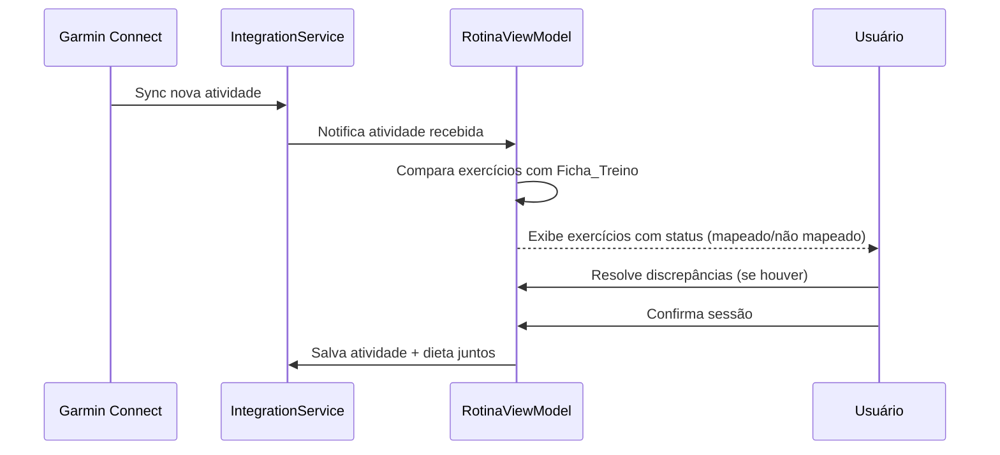

# Design Document — app-restructure

## Overview

Reestruturação do app Flutter "Apex.OS — Terminal de Desempenho" (oi_coach) para corrigir problemas de layout (safe areas, overflow de texto), simplificar a navegação de 7 para 4 abas, unificar treino e dieta em uma aba "Rotina Diária", adicionar registro manual de atividades extras, permitir input de peso no relatório, corrigir o fluxo Garmin→validação→confirmação, expandir o progresso para carga E repetições, e mover Relatório/Fichas para cards no dashboard.

O app usa Flutter com `go_router` para navegação, `google_fonts` (Space Grotesk) para tipografia, `shared_preferences` para persistência local, e segue um tema dark-only com a cor accent "volt" (#D4F53C). A arquitetura atual é feature-based com `lib/features/`, `lib/core/models/`, `lib/data/`, e `lib/shared/widgets/`.

## Architecture

### Estrutura de Diretórios (Pós-Reestruturação)

```
lib/
├── app/
│   ├── app.dart
│   ├── router.dart                    # Atualizado: 4 tabs + sub-routes
│   └── theme/
├── core/
│   └── models/
│       ├── exercise.dart
│       ├── workout.dart
│       ├── diet.dart
│       ├── weekly_report.dart
│       ├── integration.dart
│       ├── extra_activity.dart         # NOVO: modelo de atividade extra
│       ├── progress_entry.dart         # NOVO: modelo expandido de progresso
│       └── models.dart
├── data/
│   ├── repositories/
│   │   ├── workout_repository.dart
│   │   ├── diet_repository.dart
│   │   ├── report_repository.dart
│   │   ├── activity_repository.dart    # NOVO: persistência de atividades extras
│   │   └── weight_repository.dart      # NOVO: persistência de peso via SharedPreferences
│   ├── services/
│   │   └── integration_service.dart    # Atualizado: fluxo Garmin expandido
│   └── mock_data.dart
├── features/
│   ├── dashboard/                      # Hoje tab — com cards de Relatório e Fichas
│   │   └── view/
│   ├── rotina/                         # NOVO: substitui treino/ e dieta/
│   │   ├── view/
│   │   │   └── rotina_view.dart
│   │   └── view_model/
│   │       └── rotina_view_model.dart
│   ├── progresso/                      # Atualizado: carga + reps
│   │   └── view/
│   ├── configuracoes/
│   │   └── view/
│   ├── relatorio/                      # Mantido como sub-page do dashboard
│   │   └── view/
│   └── fichas/                         # Mantido como sub-page do dashboard
│       └── view/
└── shared/
    └── widgets/
        ├── app_shell.dart              # Atualizado: 4 tabs
        └── safe_page.dart              # NOVO: wrapper SafeArea + padding padrão
```

### Padrão de Navegação (go_router)

```mermaid
graph TD
    A[ShellRoute — AppShell 4 tabs] --> B[/ — DashboardView]
    A --> C[/rotina — RotinaView]
    A --> D[/progresso — ProgressoView]
    A --> E[/configuracoes — ConfiguracoesView]
    B --> F[/relatorio — RelatorioView sub-page]
    B --> G[/fichas — FichasView sub-page]
```

O `ShellRoute` mantém o `AppShell` com a bottom nav de 4 abas. Relatório e Fichas são `GoRoute` filhos da rota `/`, navegados via `context.go('/relatorio')` e `context.go('/fichas')`, mantendo a bottom nav visível com o tab "Hoje" ativo.

### Decisões de Design

1. **SafePage widget**: Criar um widget wrapper `SafePage` que aplica `SafeArea` + `EdgeInsets.all(16)` em todas as telas, eliminando a repetição de padding e garantindo consistência.
2. **Rotina unificada**: Combinar `TreinoView` + `DietaView` em uma única `RotinaView` com seções em um `ListView` — treino primeiro, dieta depois, atividades extras por último.
3. **ChangeNotifier para ViewModels**: Manter o padrão existente de `ChangeNotifier` para os view models, sem introduzir novas dependências de state management.
4. **SharedPreferences para peso**: Usar o pacote já existente `shared_preferences` para persistir o peso, mantendo consistência com a stack atual.
5. **Remoção de features/treino e features/dieta**: Após a migração para `features/rotina/`, os diretórios antigos serão removidos.

## Components and Interfaces

### Novos Widgets

#### `SafePage`
```dart
/// Wrapper que aplica SafeArea + padding padrão em todas as telas.
class SafePage extends StatelessWidget {
  final Widget child;
  final EdgeInsets padding;
  const SafePage({required this.child, this.padding = const EdgeInsets.all(16)});
}
```

#### `ActivityLogCard`
```dart
/// Card para exibir uma atividade extra registrada.
class ActivityLogCard extends StatelessWidget {
  final ExtraActivity activity;
  // Exibe: tipo, duração, badge de fonte (Manual/Garmin)
}
```

#### `AddActivitySheet`
```dart
/// Bottom sheet para adicionar atividade extra.
class AddActivitySheet extends StatefulWidget {
  // Dropdown de tipo (yoga, corrida, crossfit, natação, tênis de mesa)
  // Campo de duração em minutos
  // Botão salvar
}
```

### ViewModels Atualizados

#### `RotinaViewModel` (substitui TreinoViewModel + DietaViewModel)
```dart
class RotinaViewModel extends ChangeNotifier {
  // Estado do treino (exercícios, séries, confirmações)
  // Estado da dieta (check-ins, refeição livre, peso)
  // Estado das atividades extras
  // Computed: bool get isDailyRoutineComplete
  
  void toggleExerciseConfirmed(String exId);
  void setMealStatus(String mealId, MealStatus status);
  void setMealNote(String mealId, String note);
  void addExtraActivity(ExtraActivity activity);
  void removeExtraActivity(String activityId);
  bool get isDailyRoutineComplete; // all exercises confirmed AND all meals checked
}
```

#### `WeightRepository`
```dart
class WeightRepository {
  Future<double?> loadWeight();           // SharedPreferences.getDouble
  Future<void> saveWeight(double kg);     // SharedPreferences.setDouble
  Future<double?> loadPreviousWeight();   // Para cálculo de delta
}
```

#### `ActivityRepository`
```dart
class ActivityRepository {
  Future<List<ExtraActivity>> getActivitiesForDay(DateTime date);
  Future<void> saveActivity(ExtraActivity activity);
  Future<void> deleteActivity(String id);
}
```

### Router Atualizado

```dart
final router = GoRouter(
  initialLocation: '/',
  routes: [
    ShellRoute(
      builder: (context, state, child) => AppShell(child: child),
      routes: [
        GoRoute(
          path: '/',
          builder: (_, _) => const DashboardView(),
          routes: [
            GoRoute(path: 'relatorio', builder: (_, _) => const RelatorioView()),
            GoRoute(path: 'fichas', builder: (_, _) => const FichasView()),
          ],
        ),
        GoRoute(path: '/rotina', builder: (_, _) => const RotinaView()),
        GoRoute(path: '/progresso', builder: (_, _) => const ProgressoView()),
        GoRoute(path: '/configuracoes', builder: (_, _) => const ConfiguracoesView()),
      ],
    ),
  ],
);
```

### AppShell Atualizado

```dart
static const _tabs = [
  _Tab('/', Icons.home_outlined, 'Hoje'),
  _Tab('/rotina', Icons.calendar_today_outlined, 'Rotina'),
  _Tab('/progresso', Icons.trending_up, 'Progresso'),
  _Tab('/configuracoes', Icons.settings_outlined, 'Config'),
];
```

### Fluxo Garmin (IntegrationService expandido)



## Data Models

### `ExtraActivity` (NOVO)
```dart
enum ActivityType { yoga, corrida, crossfit, natacao, tenisDeMesa }
enum ActivitySource { manual, garmin }

class ExtraActivity {
  final String id;
  final ActivityType type;
  final int durationMinutes;      // duração em minutos, > 0
  final ActivitySource source;
  final DateTime date;

  const ExtraActivity({
    required this.id,
    required this.type,
    required this.durationMinutes,
    required this.source,
    required this.date,
  });
}
```

### `ExerciseProgressEntry` (NOVO — substitui ProgressEntry)
```dart
class ExerciseProgressEntry {
  final String exerciseId;
  final String exerciseName;
  final double previousWeight;    // kg semana anterior
  final int previousReps;         // reps semana anterior
  final double currentWeight;     // kg semana atual
  final int currentReps;          // reps semana atual

  double get weightDelta => currentWeight - previousWeight;
  int get repsDelta => currentReps - previousReps;

  /// Verde se peso OU reps melhorou
  bool get hasProgression => weightDelta > 0 || repsDelta > 0;

  /// Vermelho se peso E reps pioraram
  bool get hasRegression => weightDelta < 0 && repsDelta < 0;
}
```

### `GarminSyncResult` (NOVO)
```dart
enum ExerciseMatchStatus { mapeado, naoMapeado }

class GarminSyncResult {
  final String sessionId;
  final DateTime date;
  final List<SyncedExercise> exercises;
}

class SyncedExercise {
  final String name;
  final List<ExerciseSet> sets;
  final ExerciseMatchStatus matchStatus;
  final String? matchedExerciseId;  // ID do exercício na ficha, se mapeado
}
```

### Alterações em Modelos Existentes

- `WeeklyReport`: Adicionar campo `List<ExtraActivity> extraActivities` para incluir atividades extras no resumo semanal.
- `ProgressEntry`: Substituir por `ExerciseProgressEntry` com campos separados para peso e reps (anterior e atual).

### Validação de Peso
```dart
class WeightValidator {
  static const double minWeight = 30.0;
  static const double maxWeight = 300.0;

  /// Retorna null se válido, mensagem de erro se inválido.
  static String? validate(double? value) {
    if (value == null) return 'Peso é obrigatório';
    if (value < minWeight || value > maxWeight) {
      return 'Peso deve estar entre ${minWeight.toInt()}kg e ${maxWeight.toInt()}kg';
    }
    return null;
  }
}
```

### Validação de Atividade Extra
```dart
class ActivityValidator {
  static const validTypes = ActivityType.values;

  static String? validateDuration(int? minutes) {
    if (minutes == null || minutes <= 0) return 'Duração deve ser maior que 0';
    return null;
  }
}
```

## Correctness Properties

*A property is a characteristic or behavior that should hold true across all valid executions of a system — essentially, a formal statement about what the system should do. Properties serve as the bridge between human-readable specifications and machine-verifiable correctness guarantees.*

### Property 1: Daily routine completion indicator

*For any* combination of exercise confirmation states and meal check-in states, the daily routine completion indicator should be shown if and only if every exercise is confirmed AND every meal has a check-in status set.

**Validates: Requirements 3.3**

### Property 2: Activity input validation

*For any* string value tested against the activity type validator, it should be accepted if and only if it corresponds to one of the five valid types (yoga, corrida, crossfit, natação, tênis de mesa). Additionally, *for any* integer duration value, it should be accepted if and only if it is greater than zero.

**Validates: Requirements 4.2, 4.3**

### Property 3: Activity source badge rendering

*For any* ExtraActivity, the rendered source badge text should equal "Garmin" when the activity source is `garmin`, and "Manual" when the activity source is `manual`.

**Validates: Requirements 4.4, 4.5**

### Property 4: Multiple activities per day

*For any* non-negative integer N, adding N extra activities to a given day should result in the day's activity list having exactly N entries.

**Validates: Requirements 4.6**

### Property 5: Weight persistence round-trip

*For any* valid weight value (between 30kg and 300kg), saving it via WeightRepository and then loading it should return the same value.

**Validates: Requirements 5.2, 5.4**

### Property 6: Weight delta calculation

*For any* two weight values (current and previous), the displayed delta should equal `current - previous`.

**Validates: Requirements 5.3**

### Property 7: Weight validation range

*For any* double value, the weight validator should return null (valid) if and only if the value is in the range [30, 300], and return an error message otherwise.

**Validates: Requirements 5.5**

### Property 8: Exercise-ficha matching

*For any* synced exercise and any ficha de treino, the match function should return `mapeado` if and only if the exercise name/id exists in the ficha's exercise list, and `naoMapeado` otherwise.

**Validates: Requirements 6.2, 6.5**

### Property 9: Confirmation enabled iff all exercises validated

*For any* list of synced exercises with match statuses, the confirmation button should be enabled if and only if every exercise has status `mapeado`.

**Validates: Requirements 6.3**

### Property 10: Progress delta calculation

*For any* exercise with current week and previous week ExerciseSet data, the displayed weight delta should equal `currentTopWeight - previousTopWeight` and the displayed reps delta should equal `currentTopReps - previousTopReps`.

**Validates: Requirements 7.2, 7.3**

### Property 11: Progression indicator classification

*For any* ExerciseProgressEntry, the indicator should be green (hasProgression) if and only if `weightDelta > 0 OR repsDelta > 0`, and red (hasRegression) if and only if `weightDelta < 0 AND repsDelta < 0`.

**Validates: Requirements 7.4, 7.5**

### Property 12: Summary progression counts

*For any* list of ExerciseProgressEntry items, the weight progression count should equal the number of entries where `weightDelta > 0`, and the reps progression count should equal the number of entries where `repsDelta > 0`.

**Validates: Requirements 7.6**


## Error Handling

### Validação de Input

| Cenário | Comportamento |
|---------|---------------|
| Peso fora do range [30, 300] kg | Exibir mensagem de erro inline, não salvar |
| Duração de atividade ≤ 0 ou vazia | Desabilitar botão de salvar, exibir hint |
| Tipo de atividade não selecionado | Desabilitar botão de salvar |
| Texto de observação de dieta muito longo | Truncar com ellipsis no display, permitir scroll no input |

### Garmin Sync

| Cenário | Comportamento |
|---------|---------------|
| Garmin desconectado | Exibir status "Não conectado" em Config, permitir entrada manual completa |
| Exercício sincronizado não encontrado na ficha | Destacar com borda warning, exibir prompt "Resolver discrepância" |
| Falha na sincronização | Exibir snackbar com mensagem de erro, manter dados anteriores |
| Dados de sync incompletos (sem séries) | Exibir exercício com campos vazios para preenchimento manual |

### Persistência

| Cenário | Comportamento |
|---------|---------------|
| SharedPreferences indisponível | Fallback para valores em memória, exibir aviso discreto |
| Dados corrompidos no storage | Resetar para valores padrão, logar erro |

### Layout

| Cenário | Comportamento |
|---------|---------------|
| Texto excede largura disponível | Aplicar `TextOverflow.ellipsis` ou `softWrap: true` conforme contexto |
| Tela < 320dp de largura | Labels da bottom nav usam fontSize reduzido, ícones mantêm tamanho mínimo |
| Notch/Dynamic Island | SafeArea wrapper em todas as telas via SafePage widget |

## Testing Strategy

### Abordagem Dual: Unit Tests + Property-Based Tests

O projeto usa `flutter_test` (já presente em dev_dependencies). Para property-based testing, será utilizada a biblioteca **glados** (Dart PBT library) que fornece geração automática de inputs e shrinking.

### Unit Tests (Exemplos e Edge Cases)

Foco em cenários específicos e verificações estruturais:

- **Navegação**: Verificar que as 4 abas navegam para as views corretas
- **Layout**: Verificar presença de SafeArea, padding de 16dp em cada tela
- **Bottom nav**: Verificar exatamente 4 tabs com labels corretos, sem overflow em 320dp
- **Rotina view**: Verificar que treino aparece antes de dieta, seção de atividades extras presente
- **Dashboard cards**: Verificar presença dos cards de Relatório e Fichas, navegação como sub-pages
- **Garmin fallback**: Verificar entrada manual disponível quando Garmin desconectado
- **Relatório**: Verificar campo de peso editável presente

### Property-Based Tests (via glados)

Cada property test deve rodar no mínimo 100 iterações e referenciar a property do design:

| Property | Tag | Descrição |
|----------|-----|-----------|
| 1 | Feature: app-restructure, Property 1: Daily routine completion indicator | Completion iff all confirmed + all checked |
| 2 | Feature: app-restructure, Property 2: Activity input validation | Type in valid set, duration > 0 |
| 3 | Feature: app-restructure, Property 3: Activity source badge rendering | Badge matches source |
| 4 | Feature: app-restructure, Property 4: Multiple activities per day | N adds → N entries |
| 5 | Feature: app-restructure, Property 5: Weight persistence round-trip | Save then load = same value |
| 6 | Feature: app-restructure, Property 6: Weight delta calculation | Delta = current - previous |
| 7 | Feature: app-restructure, Property 7: Weight validation range | Valid iff in [30, 300] |
| 8 | Feature: app-restructure, Property 8: Exercise-ficha matching | Mapeado iff exists in ficha |
| 9 | Feature: app-restructure, Property 9: Confirmation enabled iff all validated | Enabled iff all mapeado |
| 10 | Feature: app-restructure, Property 10: Progress delta calculation | Deltas = arithmetic differences |
| 11 | Feature: app-restructure, Property 11: Progression indicator classification | Green iff weight↑ OR reps↑, Red iff both↓ |
| 12 | Feature: app-restructure, Property 12: Summary progression counts | Counts = filtered list lengths |

### Configuração

- Adicionar `glados: ^1.1.1` em `dev_dependencies` do `pubspec.yaml`
- Cada test file referencia a property com comentário: `// Feature: app-restructure, Property N: ...`
- Mínimo 100 iterações por property test (configurável via `Glados(...).test(...)`)
- Usar `SharedPreferences.setMockInitialValues({})` para testes de persistência de peso
