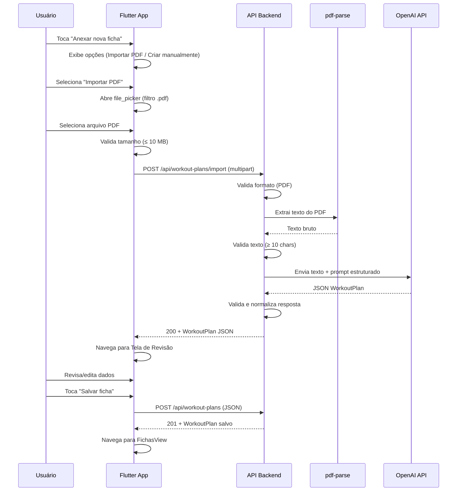
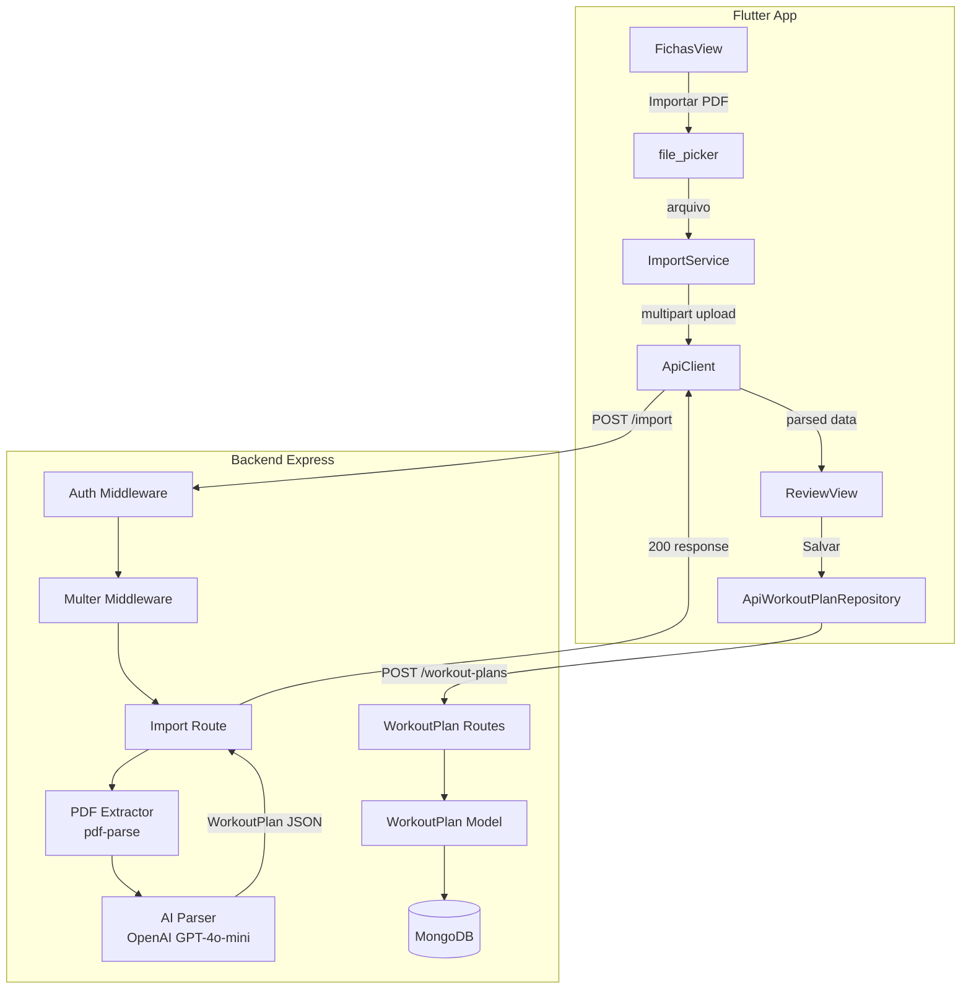

# Design — Importação de Ficha de Treino

## Overview

Este design cobre a funcionalidade de importação e criação manual de fichas de treino no app Apex.OS. O fluxo principal permite que o usuário faça upload de um PDF contendo sua ficha de treino, o backend extraia o texto com `pdf-parse`, envie para a API da OpenAI (GPT-4o-mini) para parsing estruturado, e retorne um `WorkoutPlan` para revisão no app antes de salvar.

### Decisões de Design

- **pdf-parse** para extração de texto do PDF — biblioteca leve, sem dependências nativas, ideal para PDFs com texto selecionável (não-escaneados).
- **multer** para upload multipart — middleware Express padrão para file uploads, com limites de tamanho configuráveis.
- **GPT-4o-mini** via API OpenAI — custo-benefício ideal para parsing estruturado de texto. Resposta em JSON mode garante output parseável.
- **file_picker** no Flutter — suporte cross-platform (web, mobile) para seleção de arquivos com filtro por extensão.
- **http.MultipartRequest** no Flutter — envio multipart nativo sem dependências extras, já que o pacote `http` está no projeto.
- **Endpoint de import separado do save** — o endpoint `POST /api/workout-plans/import` retorna o WorkoutPlan parseado sem salvar. O save usa o endpoint existente `POST /api/workout-plans`. Isso permite revisão/edição antes da persistência.
- **Tela de Revisão reutilizada para criação manual** — mesmos componentes de edição, apenas com dados iniciais diferentes (vazio vs. extraído do PDF).
- **Prompt estruturado com JSON Schema** — o prompt da LLM inclui o schema esperado e exemplos, garantindo output consistente.

## Architecture

### Diagrama de Arquitetura — Fluxo de Importação



### Diagrama de Componentes



## Components and Interfaces

### Backend — Novos Componentes

#### 1. Import Route (`backend/src/routes/workoutPlanImport.js`)

Rota dedicada para o fluxo de importação de PDF.

```javascript
// POST /api/workout-plans/import
// Headers: Authorization: Bearer <token>, Content-Type: multipart/form-data
// Body: file (PDF, max 10 MB)
// Response 200: { name, days: [{ id, name, focus, day, exercises: [...] }] }
// Response 400: { error: "Formato de arquivo inválido. Envie um arquivo PDF." }
// Response 422: { error: "Não foi possível extrair texto do PDF..." }
// Response 422: { error: "Não foi possível interpretar a ficha..." }
// Response 503: { error: "Serviço de IA temporariamente indisponível..." }
```

#### 2. PDF Extractor (`backend/src/services/pdfExtractor.js`)

Módulo que encapsula a extração de texto via `pdf-parse`.

```javascript
// Interface
async function extractTextFromPdf(buffer) → string
// - Recebe o Buffer do arquivo PDF
// - Retorna o texto extraído
// - Lança erro se a extração falhar
```

#### 3. AI Parser (`backend/src/services/aiParser.js`)

Módulo que encapsula a chamada à API OpenAI para parsing do texto.

```javascript
// Interface
async function parseWorkoutText(text) → WorkoutPlan
// - Recebe o texto extraído do PDF
// - Envia prompt estruturado à API OpenAI (GPT-4o-mini)
// - Retorna objeto WorkoutPlan parseado
// - Lança erro se a resposta não for válida ou a API estiver indisponível
```

#### 4. Workout Plan Formatter (`backend/src/services/workoutPlanFormatter.js`)

Módulo que converte um WorkoutPlan em texto legível (pretty printer) e vice-versa.

```javascript
// Interface
function formatWorkoutPlanToText(workoutPlan) → string
// - Recebe um objeto WorkoutPlan
// - Retorna representação textual organizada por dia de treino

function parseFormattedText(text) → WorkoutPlan
// - Recebe texto no formato produzido por formatWorkoutPlanToText
// - Retorna objeto WorkoutPlan equivalente
```

#### 5. Multer Config (`backend/src/middleware/upload.js`)

Configuração do multer para upload de arquivos em memória.

```javascript
// Interface
const upload = multer({
  storage: multer.memoryStorage(),
  limits: { fileSize: 10 * 1024 * 1024 }, // 10 MB
  fileFilter: (req, file, cb) => {
    // Aceita apenas application/pdf
  }
});
```

### Backend — Modificações em Componentes Existentes

#### `backend/src/index.js`

Registrar a nova rota de importação:

```javascript
const workoutPlanImportRoutes = require('./routes/workoutPlanImport');
app.use('/api/workout-plans/import', authMiddleware, workoutPlanImportRoutes);
// IMPORTANTE: registrar ANTES da rota /api/workout-plans para evitar conflito
```

### Flutter — Novos Componentes

#### 1. Import Service (`lib/data/services/import_service.dart`)

Serviço que gerencia o upload multipart do PDF.

```dart
class ImportService {
  final ApiClient _apiClient;

  /// Envia o PDF ao backend e retorna o WorkoutPlan parseado.
  Future<Map<String, dynamic>> uploadPdf(Uint8List bytes, String fileName);
  // - Cria MultipartRequest para POST /api/workout-plans/import
  // - Anexa o arquivo como campo 'file'
  // - Retorna o JSON do WorkoutPlan parseado
}
```

#### 2. Review View (`lib/features/fichas/view/review_view.dart`)

Tela de revisão e edição do WorkoutPlan (usada tanto para import quanto criação manual).

```dart
class ReviewView extends StatefulWidget {
  final Map<String, dynamic>? initialPlan; // null = criação manual

  // Exibe dias de treino com exercícios editáveis
  // Permite adicionar/remover dias e exercícios
  // Permite editar nome da ficha
  // Botão "Salvar ficha" com validação
}
```

#### 3. Import View Model (`lib/features/fichas/view_model/import_view_model.dart`)

ChangeNotifier que gerencia o estado do fluxo de importação.

```dart
class ImportViewModel extends ChangeNotifier {
  bool get isUploading;
  bool get isSaving;
  String? get error;
  Map<String, dynamic>? get parsedPlan;

  Future<void> uploadPdf(Uint8List bytes, String fileName);
  Future<void> savePlan(Map<String, dynamic> plan);
  void clearError();
}
```

### Flutter — Modificações em Componentes Existentes

#### `ApiClient` — Novo método multipart

Adicionar suporte a upload multipart:

```dart
/// Envia um arquivo via multipart/form-data.
Future<dynamic> uploadFile(String path, Uint8List bytes, String fileName) async {
  final uri = Uri.parse('$_baseUrl$path');
  final request = http.MultipartRequest('POST', uri);
  final headers = await _headers();
  request.headers.addAll(headers);
  request.files.add(http.MultipartFile.fromBytes('file', bytes, filename: fileName));
  final streamedResponse = await _client.send(request);
  final response = await http.Response.fromStream(streamedResponse);
  return _handleResponse(response, () => uploadFile(path, bytes, fileName));
}
```

#### `ApiWorkoutPlanRepository` — Novo método de import

```dart
/// Envia PDF para parsing e retorna o WorkoutPlan extraído (sem salvar).
Future<Map<String, dynamic>> importFromPdf(Uint8List bytes, String fileName) async {
  return await _apiClient.uploadFile('/workout-plans/import', bytes, fileName);
}
```

#### `FichasView` — Botão "Anexar nova ficha"

O botão existente passa a abrir um bottom sheet com duas opções:
- "Importar PDF" → abre file_picker → upload → navega para ReviewView
- "Criar manualmente" → navega para ReviewView com plano vazio

#### GoRouter — Novas rotas

```dart
GoRoute(path: '/fichas/review', builder: (_, state) => ReviewView(initialPlan: state.extra))
```

## Data Models

### Prompt da LLM — Schema Esperado

O prompt enviado à API OpenAI solicita resposta no seguinte formato JSON:

```json
{
  "name": "Nome da Ficha",
  "days": [
    {
      "id": "day-1",
      "name": "Treino 1",
      "focus": "Push",
      "day": "Dia 1",
      "exercises": [
        {
          "id": "ex-1-1",
          "order": 1,
          "name": "Supino Reto com Barra",
          "targetSets": 3,
          "targetReps": "8-12",
          "targetWeight": 0
        }
      ]
    }
  ]
}
```

### Prompt Estruturado para a LLM

```
Você é um assistente especializado em interpretar fichas de treino.
Analise o texto extraído de um PDF de ficha de treino e converta para o formato JSON abaixo.

Regras:
1. Cada seção "TREINO N - Nome" vira um dia de treino.
2. Extraia o nome e foco do título (ex: "TREINO 1 - Push" → name: "Treino 1", focus: "Push").
3. Para cada exercício, extraia o nome e a metodologia.
4. Na metodologia, conte apenas sets de TRABALHO (ignore "aquecimento" e "feeder sets").
5. Extraia targetReps no formato "X-Y" quando houver faixa (ex: "6 a 10" → "6-10").
6. Se houver apenas um número de reps, use esse número (ex: "3 sets de 12" → targetReps: "12").
7. Atribua order sequencial (1, 2, 3...) para cada exercício dentro do dia.
8. Normalize nomes: primeira letra maiúscula, sem abreviações ambíguas.
9. targetWeight sempre 0 (será preenchido pelo usuário).
10. Gere IDs únicos no formato "day-N" e "ex-N-M".

Formato de saída (JSON):
{schema}

Texto do PDF:
{texto_extraido}
```

### Mapeamento de Metodologia — Exemplos

| Metodologia Original | targetSets | targetReps |
|---|---|---|
| "Aquecimento + 2 feeder sets + 2 sets de 6 a 10" | 2 | "6-10" |
| "3 sets de 8 a 12" | 3 | "8-12" |
| "Aquecimento + 3 sets de 10 a 15" | 3 | "10-15" |
| "4 sets de 12" | 4 | "12" |
| "2 feeder sets + 3 sets de 6 a 8" | 3 | "6-8" |

### Validação do WorkoutPlan (Backend)

Função de validação aplicada à resposta da LLM antes de retornar ao cliente:

```javascript
function validateWorkoutPlan(plan) → { valid: boolean, errors: string[] }
// Verifica:
// - plan.name é string não-vazia
// - plan.days é array com pelo menos 1 elemento
// - Cada day tem id, name, focus, day (strings não-vazias)
// - Cada day tem exercises com pelo menos 1 elemento
// - Cada exercise tem id, name (strings não-vazias), order (number > 0),
//   targetSets (number > 0), targetReps (string não-vazia)
```

### Validação do WorkoutPlan (Flutter — antes de salvar)

```dart
// Valida que:
// - O plano tem pelo menos 1 dia de treino
// - Cada dia tem pelo menos 1 exercício
// - Cada exercício tem name não-vazio
// - Cada exercício tem targetSets > 0 e targetReps não-vazio
```

### Novas Dependências

**Backend (package.json):**
- `pdf-parse` — extração de texto de PDFs
- `multer` — middleware para upload multipart/form-data
- `openai` — SDK oficial da OpenAI para chamadas à API

**Flutter (pubspec.yaml):**
- `file_picker` — seleção de arquivos cross-platform

### Variáveis de Ambiente (Backend)

```
OPENAI_API_KEY=sk-...    # Chave da API OpenAI
```


## Correctness Properties

*Uma propriedade é uma característica ou comportamento que deve ser verdadeiro em todas as execuções válidas de um sistema — essencialmente, uma declaração formal sobre o que o sistema deve fazer. Propriedades servem como ponte entre especificações legíveis por humanos e garantias de corretude verificáveis por máquina.*

### Property 1: Round-trip de formatação do WorkoutPlan

*Para qualquer* objeto WorkoutPlan válido (com pelo menos um dia contendo pelo menos um exercício), aplicar `formatWorkoutPlanToText` seguido de `parseFormattedText` SHALL produzir um objeto equivalente ao original — mesmos dias, mesmos exercícios com mesmos name, targetSets, targetReps e order.

**Validates: Requirements 8.1, 8.2, 8.3**

### Property 2: Texto formatado contém todos os campos obrigatórios

*Para qualquer* objeto WorkoutPlan válido, o texto produzido por `formatWorkoutPlanToText` SHALL conter, para cada Dia_de_Treino, o nome e o foco do dia, e para cada exercício, o order, name, targetSets e targetReps.

**Validates: Requirements 8.2**

### Property 3: Invariante de ordem sequencial após mutações

*Para qualquer* lista de exercícios dentro de um Dia_de_Treino, após adicionar um novo exercício ou remover um exercício existente (em qualquer posição válida), os exercícios resultantes SHALL ter valores de `order` sequenciais começando em 1 (1, 2, 3, ..., N).

**Validates: Requirements 3.7, 4.4, 4.5**

### Property 4: Validação do WorkoutPlan aceita apenas planos com conteúdo

*Para qualquer* objeto WorkoutPlan gerado aleatoriamente, a função de validação SHALL retornar `true` se e somente se o plano contém pelo menos um Dia_de_Treino com pelo menos um exercício cujo `name` é não-vazio, `targetSets` > 0 e `targetReps` é não-vazio.

**Validates: Requirements 4.9, 4.10, 5.3**

## Error Handling

### Backend — Erros do Endpoint de Importação

| Cenário | Status | Mensagem | Ação |
|---------|--------|----------|------|
| Arquivo não é PDF | 400 | "Formato de arquivo inválido. Envie um arquivo PDF." | Rejeita no multer fileFilter |
| Arquivo excede 10 MB | 400 | "O arquivo excede o tamanho máximo de 10 MB." | Rejeita no multer limits |
| Nenhum arquivo enviado | 400 | "Nenhum arquivo enviado." | Verifica req.file no handler |
| Texto extraído < 10 chars | 422 | "Não foi possível extrair texto do PDF. Verifique se o arquivo contém texto selecionável." | Após pdf-parse |
| Resposta da LLM inválida | 422 | "Não foi possível interpretar a ficha. Revise o PDF ou crie a ficha manualmente." | Após validação do JSON |
| API OpenAI indisponível | 503 | "Serviço de IA temporariamente indisponível. Tente novamente em alguns minutos." | Catch no aiParser |
| Erro na extração de texto | 500 | "Erro ao processar o PDF. Tente novamente." | Catch no pdfExtractor |
| Token não fornecido/inválido | 401 | "Token não fornecido" / "Token expirado" | Auth middleware existente |

### Flutter — Erros no Fluxo de Importação

| Cenário | Comportamento |
|---------|---------------|
| Arquivo > 10 MB selecionado | Exibe mensagem de erro antes do upload, não envia |
| API retorna 400 (formato inválido) | Exibe mensagem de erro, permite tentar novamente |
| API retorna 422 (texto insuficiente) | Exibe mensagem de erro, sugere criar manualmente |
| API retorna 422 (parsing falhou) | Exibe mensagem de erro, sugere criar manualmente |
| API retorna 503 (IA indisponível) | Exibe mensagem de erro, sugere tentar mais tarde |
| API retorna 500 (erro interno) | Exibe mensagem genérica de erro |
| Erro de rede durante upload | Exibe "Sem conexão com a internet" |
| API retorna erro ao salvar (POST /workout-plans) | Exibe erro, mantém dados na tela de edição |
| Validação local falha (plano vazio) | Exibe "A ficha deve conter pelo menos um dia de treino com um exercício." |

## Testing Strategy

### Abordagem Dual: Unit Tests + Property-Based Tests

Este projeto usa uma abordagem dual de testes:

- **Unit tests (example-based)**: Verificam cenários específicos, edge cases e condições de erro
- **Property-based tests**: Verificam propriedades universais que devem valer para todas as entradas válidas

### Property-Based Testing

**Biblioteca backend**: `fast-check` (Node.js)
**Biblioteca Flutter**: `glados` (já presente como dev_dependency)

**Configuração**:
- Mínimo 100 iterações por property test
- Cada test deve referenciar a propriedade do design document
- Tag format: **Feature: workout-plan-import, Property {number}: {property_text}**

**Properties a implementar (backend — fast-check)**:
- Property 1: Round-trip de formatação do WorkoutPlan
- Property 2: Texto formatado contém todos os campos obrigatórios

**Properties a implementar (Flutter — glados)**:
- Property 3: Invariante de ordem sequencial após mutações
- Property 4: Validação do WorkoutPlan aceita apenas planos com conteúdo

### Unit Tests (Example-Based)

**Backend unit tests**:
- `pdfExtractor`: extrai texto de um PDF de exemplo corretamente
- `pdfExtractor`: lança erro para buffer inválido
- `aiParser`: retorna WorkoutPlan válido para texto de exemplo (mock OpenAI)
- `aiParser`: lança erro quando OpenAI retorna JSON inválido (mock)
- `aiParser`: lança erro quando OpenAI está indisponível (mock)
- `validateWorkoutPlan`: aceita plano válido
- `validateWorkoutPlan`: rejeita plano sem dias
- `validateWorkoutPlan`: rejeita plano com dia sem exercícios
- Import endpoint: retorna 400 para arquivo não-PDF
- Import endpoint: retorna 422 para PDF com texto insuficiente
- Import endpoint: retorna 200 com WorkoutPlan para PDF válido (mocks)
- Import endpoint: retorna 401 sem token de autenticação
- Metodologia parsing: "Aquecimento + 2 feeder sets + 2 sets de 6 a 10" → sets=2, reps="6-10"
- Metodologia parsing: "3 sets de 8 a 12" → sets=3, reps="8-12"

**Flutter unit tests**:
- ImportViewModel: upload bem-sucedido atualiza parsedPlan
- ImportViewModel: upload com erro atualiza error
- ImportViewModel: savePlan chama createWorkoutPlan no repository
- ReviewView: exibe todos os dias e exercícios do plano
- ReviewView: permite editar campos de exercício
- ReviewView: adicionar exercício incrementa lista
- ReviewView: remover exercício atualiza lista e reordena
- ReviewView: adicionar dia de treino incrementa lista
- ReviewView: remover dia de treino remove dia e exercícios
- ReviewView: validação rejeita plano vazio com mensagem correta
- ReviewView: salvar com sucesso navega para FichasView
- ReviewView: salvar com erro mantém dados e exibe mensagem
- FichasView: botão "Anexar nova ficha" exibe opções
- ApiClient.uploadFile: envia multipart request com headers corretos

### Integration Tests

- Fluxo completo: upload PDF → parsing → revisão → salvar → verificar na FichasView
- Fluxo manual: criar manualmente → preencher → salvar → verificar na FichasView
- Import endpoint com PDF real de exemplo → verificar estrutura do WorkoutPlan retornado
- Verificar que import endpoint não salva no banco (apenas retorna dados)
